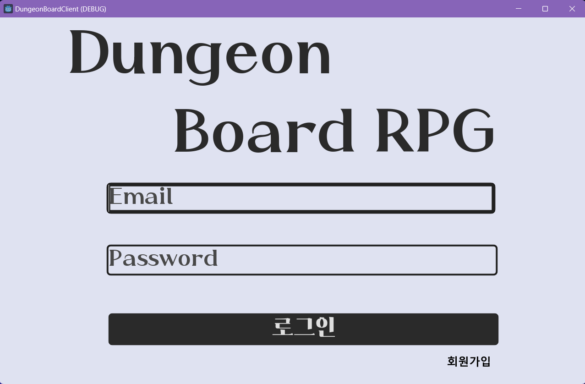
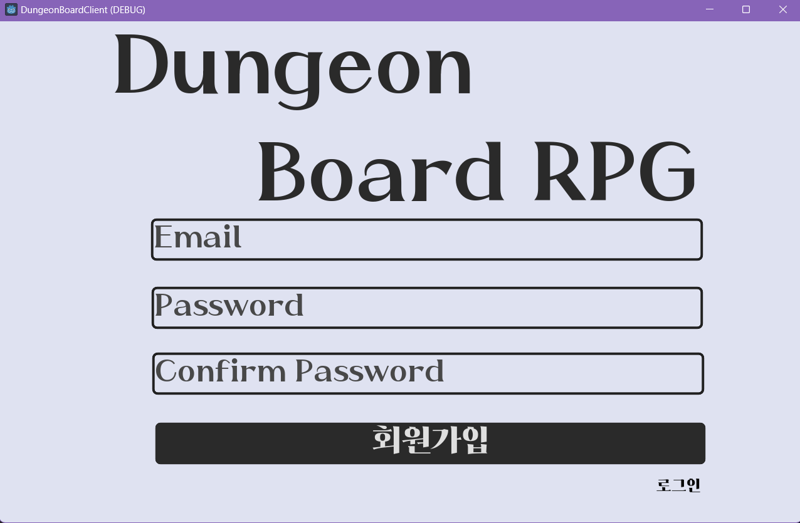
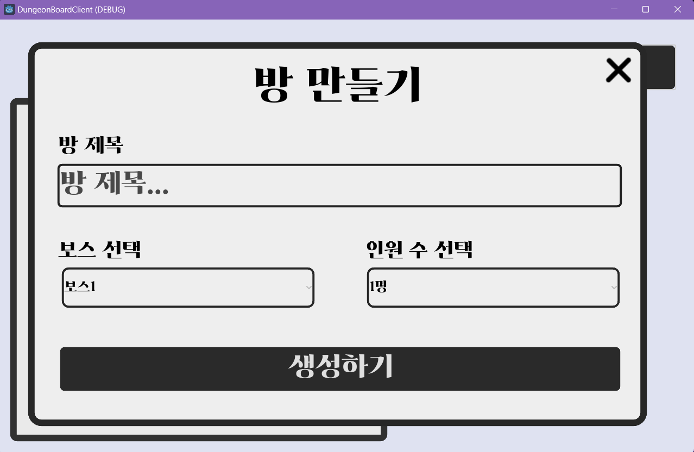
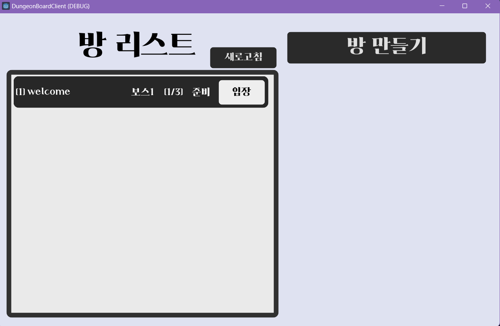
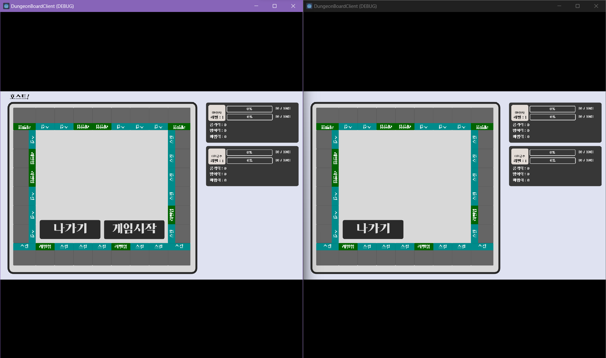
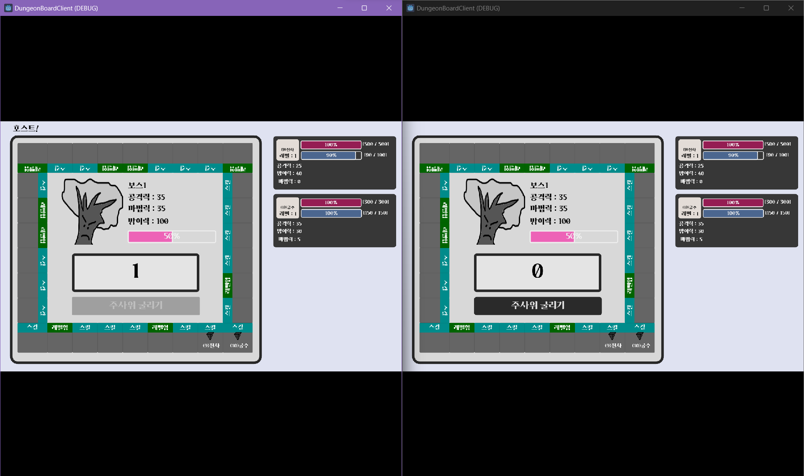
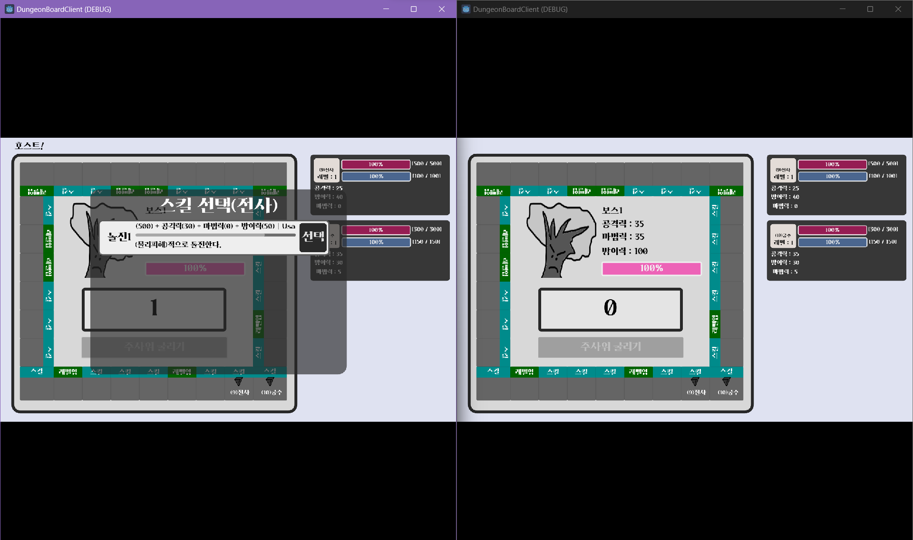

# DungeonBoard
협동으로 보스를 물리치는 멀티플레이어 보드게임

HTTP Request를 일정시간마다 폴링하는 형식으로 실시간을 구현.   
주로 Mysql보단 Redis에서 작업하는 경우가 많아 Lua Script로 원자성을 부여하여 다른 스레드의 명령어가 겹치지 않게 구현.

# 사용 기술 스택
Client : Godot  
Backend : ASP.NET CORE 7, MYSQL, Redis

# 주요 로직 
## 유저 생성 
1. 유저의 입력값 검증 
2. 유저의 회원가입 유무 확인 
3. Account Table에 유저가 정상 등록되었다면 Players 테이블에 Insert를 진행한다. 
4. 만약 Players 테이블에 저장이 실패되었다면 Account 테이블의 내용 삭제 
```C#
Result = await _playerDB.CreatePlayerData(userId);
if(Result != ErrorCode.None)
{
    // UNDO !!
    var Error = await _accountDB.DeleteAccount(userId);
    if(Error != ErrorCode.None)
    {
        return new RegisterResponse
        {
            Result = Error
        };
    }
    return new RegisterResponse
    {
        Result = Result
    };
}
```

## 방 생성
1. 방 생성을 요청한 유저의 현재 플레이 상태가 로비(로그인)상태인지 확인  
2. 입력값 검증   
3. 유저 상태 변경   
4. Redis에 방생성  

생성된 ROOM 객체는 Redis의 Sets으로 관리 
```C#
public class RedisRoom
    {
        public int RoomId { get; set; }
        public string Title { get; set; }
        public int HeadCount { get; set; }
        public int[] Users { get; set; }
        public int HostUserId { get; set; }
        public int BossId { get; set; }
        public RoomState State { get; set; }
    }
```
이 때 중요한 사항은 RoomId를 유니크하게 관리하여야 한다는 것이다. 웹서버에서 싱글톤으로 관리한다면 웹서버가 스케일아웃을 하였을 때 해당 값이 유니크하게 관리되지 못한다는 단점이 있다. 그렇기에 Redis에 {UNIQUE_KEY : Value}를 생성하여 값을 유니크 하게 관리할 수 있다.   

  
단, 이 때 유니크의 관리하기 위해 2가지의 명령어를 사용한다. 
1. GET UNIQUE_KEY
2. INCR UNIQUE_KEY   
이 명령어들 사이에 다른 명령어가 끼어들면 문제가 발생하기에 2가지의 명령어를 Lua Script를 통해서 하나로 제작 

```lua
local roomId = tonumber(redis.call('get', KEYS[1])) 
redis.call('incr', KEYS[1])
return roomId
```

## 방 입장 
1. 방 입장을 요청한 유저의 현재 플레이 상태가 로비(로그인)상태인지 확인
2. 입력값 검증 
3. 요청된 방 Redis로 부터 로드 및 유저 기입 
4. 유저 상태 변경 


유저가 방에 들어갈 시 사용되는 Redis 명령어는 2개이다.  
1. SMEMBERS 명령어를 통해 불러온 RedisRoom 배열에서 RoomId가 요청된 값과 일치하는 RedisRoom 확인 
2. RedisRoom의 Users에 userId 기입 

Redis는 명령어 단위로 처리하기 때문에 1번 명령어와 2번 명령어를 진행하는 사이에 다른 스레드의 요청(명령어)이 끼어들면 문제가 발생할 수 있다.
그렇기에 1번과 2번을 Lua Script를 통해 하나의 명령어로 원자적으로 실행해야 한다. 
```lua
local rooms = redis.call('SMEMBERS', KEYS[1])
for _, member in ipairs(rooms) do 
    local obj = cjson.decode(member)
    if tonumber(obj.RoomId) == tonumber(ARGV[1]) then 
        if #obj.Users < obj.HeadCount then
            redis.call('SREM', KEYS[1], member)
            table.insert(obj.Users, tonumber(ARGV[2]))     
            redis.call('SADD', KEYS[1], cjson.encode(obj))
            return 0
        else
            return 1
        end
    end
end 
return 2
``` 
향후 방 업데이트, 삭제시에도 Lua Script를 통해서 원자적으로 해결했다. 
### 방 삭제 
```lua
local rooms = redis.call('SMEMBERS', KEYS[1])
for _, member in ipairs(rooms) do 
    local obj = cjson.decode(member)
    if tonumber(obj.RoomId) == tonumber(ARGV[1]) then 
        redis.call('SREM', KEYS[1], member)
    end
end 
```

### 방 업데이트 
```lua 
local rooms = redis.call('SMEMBERS', KEYS[1])
for _, member in ipairs(rooms) do 
    local obj = cjson.decode(member)
    if tonumber(obj.RoomId) == tonumber(ARGV[1]) then 
        redis.call('SREM', KEYS[1], member)
        redis.call('SADD', KEYS[1], ARGV[2])
    end
end 
```


## 게임 시작 
1. 게임 시작을 요청한 유저가 방에 포함된 상태인지 확인
2. 입력값 검증 
3. 해당 방의 Host인지 확인 
4. 방의 상태가 준비상태인지 확인 
5. Game 객체를 만들어 Redis에 저장한다. 이 때 Key는 RoomId값으로 한다. 
``` C#
    public class GamePlayer
    {
        public int UserId { get; set; }
        public int ClassId { get; set; }
        public int Hp { get; set; }
        public int MaxHp { get; set; }
        public int Mp { get; set; }
        public int MaxMp { get; set; }
        public int Attack { get; set; }
        public int Defence { get; set; }
        public int Magic { get; set; }
        public int Level { get; set; }
        public int PositionCard { get; set; }
    }

    public class WhoIsTurn
    {
        public int Index { get; set; }
        public int UserId { get; set; }
    }

    public class RedisGame
    {
        public int GameId { get; set; }
        public MasterBossInfo? BossInfo { get; set; }
        public GamePlayer[]? Players { get; set; }
        public WhoIsTurn? WhoIsTurn { get; set; }
        public int Round { get; set; }
        public GameResult GameResult { get; set; }
    }
```

## 방 정보 갱신 
클라이언트는 해당 방의 상태 업데이트(다른 유저의 입장)를 위해 일정시간 마다 서버로부터 HTTP REQUEST를 보낸다. 
```
POST /Room/Load
```

## 게임 정보 갱신 
클라이언트는 해당 게임의 상태 업데이트(유저 상태, 턴, 보스 상태, 유저 위치 조정)를 위해 일정시간 마다 서버로부터 HTTP REQUEST를 보낸다. 

해당 리퀘스트는 게임이 시작될 떄만 보내며 게임이 끝났거나 시작하지 않았을 경우에는 요청을 보내지 않는다. 

```
POST /Game/Load
```

## Trouble Shooting 
1. 요청을 많이 보내면 Mysql Connection Pool이 부족하다는 에러가 뜬다. 이떄 서비스 클래스에 IDisposable 인테페이스를 상속하고 
Dispose()함수와 Dispose(true) 함수를 통해 요청이 끝난 mysql connection에 대해 close해줘야 한다. 

이 때 Dispose(bool disposing) 함수는 멱등성함수로 구현하여 Dispose가 여러번 호출되더라도 한번만 Close()할 수 있게 하여야 한다. 
``` C#
protected virtual void Dispose(bool disposing)
{
    if (_disposed)
    {
        return;
    }

    if (disposing)
    {
        // TODO: dispose managed state (managed objects).
        dbConnection.Close();
    }

    _disposed = true;
}

public void Dispose()
{
    Dispose(true);
    GC.SuppressFinalize(this);
}
```

# Images 
로그인


회원가입 


방 만들기 


로비 


룸 레디


룸 시작 


스킬 선택 


